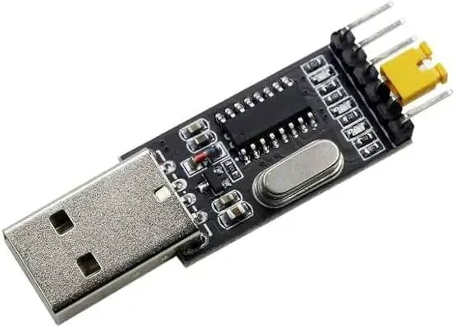
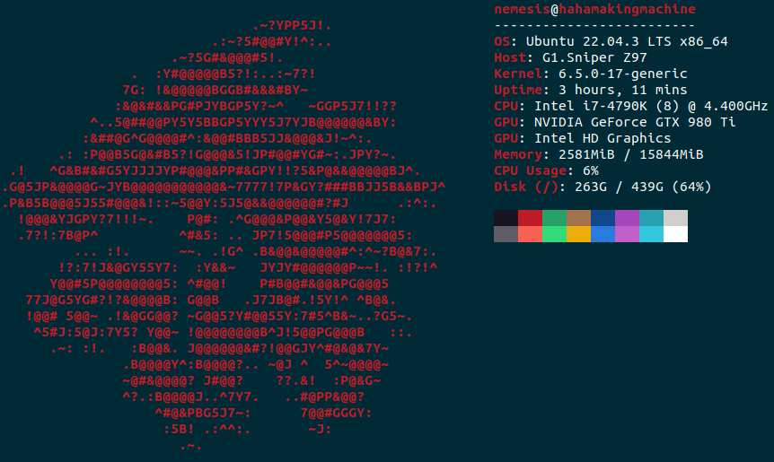

# ROS1_on_Yocto_For_RPi4

## Introduction

### Author's Note
This README file is a step-by-step tutorial on how to add and use ROS on a Yocto image for Raspberry Pi 4. In the process of research, I have found that the "official" `meta-ros` layer is depricated, full of bugs, and most importantly has no support for the latest LTS version of The Yocto Project: Kirkstone---at the time of writing this (2/2024). So, here I will document the entire process of building it: starting from cloning `poky` and `openembedded` to running `roscore` one the Pi.

## Target Hardware Specifications
As stated earlier, the target hardware is a Raspberry Pi 4 8GB Rev 1.5C with the following pin configuration. Knowing the pin configuration will be important later on in order to communicate with the Pi later on via a serial terminal like `gtkterm` using a USB-to-TTL device as shown below.



## Build Device Specifications
I have built this Yocto image on a PC with the specifications stated below. I made sure to record the time it took me to build the image for reference. Bare in mind that performance may differ duo to multiple reasons such as: temperature---a laptop is more likely to throttle than a PC; disk speed---I built it entirely on an SSD and it took over 2 hours, I can hardly imagine how long it would take to build an image on an HDD; and lastly the performance of your machine---I am running a native/real Ubuntu 22.04 machine, not a VM.


With all the exposition out of the way, let us begin.


## Setting Up Yocto Project Essentials

1. Start things off with by updating and upgrading packages.
   ```
   sudo apt update && upgrade -y
   ```

1. The Yocto Project documentation recommends installing the following packages.
   ```
   sudo apt install gawk wget git diffstat unzip texinfo gcc build-essential chrpath socat cpio python3 python3-pip python3-pexpect xz-utils debianutils iputils-ping python3-git python3-jinja2 libegl1-mesa libsdl1.2-dev python3-subunit mesa-common-dev zstd liblz4-tool file locales libacl1
   ```


## Cloning Project Layers (All layers must be present in the SAME folder)

1. Now, in the project folder, clone the reference distro `poky`. 
   ```
   https://github.com/yoctoproject/poky.git
   ```

1. Next, in the same project folder (beside `poky`), clone the `openembedded` layer repository.
   ```
   https://github.com/openembedded/meta-openembedded.git
   ```

1. Since the target hardware is a Raspberry Pi board, it is time to clone the Board Support Package (BSP) made for Raspberry Pi---`meta-raspberrypi`
   ```
   https://github.com/agherzan/meta-raspberrypi.git
   ```

1. Finally, it is time to clone the star of the show: `meta-ros`. As stated earlier, the "official"---as in the one you can find in Openembedded Layer Index---is deprecated and full of bugs; so I will not use it. Luckily, [RethinkRobotics-opensource](https://github.com/RethinkRobotics-opensource) forked a repository that was forked from a fork of the original `meta-ros` that is up-to-date and fully functional. Huge shoutout to them. For now, I will simply clone their repository.
   ```
   https://github.com/RethinkRobotics-opensource/meta-ros.git
   ```


## Choosing Yocto Version

As of the time this tutorial is written, the latest LTS version of The Yocto Project is Kirkstone. So, I will be using that. Make sure to checkout the correct branch in each of the layers we had cloned.

  1. To see which branch you are currently on:
     ```
     git status
     ```
  1. To view all the branches available in said repository:
     ```
     git branch -a
     ```
  1. To checkout a branch in a repository:
     ```
     git checkout BRANCH_NAME_Kirkstone
     ```
     
**VIMP**: For the `meta-ros` layer, since I want to use `ROS1 Noetic`, make sure to checkout the branch `superflore/noetic/2023-09-15`.


## Creating A New Project and Adding Layers

1. Change directory into the project folder where all layers' folders are visible to you.

1. Source the script located in the `poky` folder to start `bitbake` and create a new image folder. Here, I named my image `build-RPi4-ROS`. Conventionally, all image names start with `build` to make them distinct. Sourcing this script will change your directory to a new folder named the same as the image name and start bitbake.
   ```
   source poky/oe-init-build-env build-RPi4-ROS
   ```

1. The layers added to the image can be viewed by inserting the command:
   ```
   bitbake-layers show-layers
   ```

1. Next, we will start adding layers one by one to the image using the command `bitbake-layers add-layer`. Note that `meta-raspberrypi` depends on other layers to function correctly, hence they will be added before it. Same story goes to `meta-ros`. Ergo, add the layers in the same order as written here to avoid any unnecessary errors.
   ```
   bitbake-layers add-layer ../meta-openembedded/meta-oe
   bitbake-layers add-layer ../meta-openembedded/meta-python
   bitbake-layers add-layer ../meta-openembedded/meta-networking
   bitbake-layers add-layer ../meta-openembedded/meta-multimedia
   bitbake-layers add-layer ../meta-raspberrypi
   bitbake-layers add-layer ../meta-ros/meta-ros-common
   bitbake-layers add-layer ../meta-ros/meta-ros1
   bitbake-layers add-layer ../meta-ros/meta-ros1-noetic
   ```


## Additions to `local.conf`

1. Change directory to where `local.conf` is located in the image folder.
   ```
   cd conf
   ```

1. Open `local.conf` using a text editor. Here, I open it using `gedit`
   ```
   gedit local.conf
   ```
   
### Essential Additions

Comment any line that specifies a certain `MACHINE` and add this one:
  ```
  ## Machine Name: MUST INCLUDE
  MACHINE = "raspberrypi4-64"
  ```

UART must be enabled in order to be able to communicate with the Pi using serial terminal.
  ```
  ENABLE_UART = "1"
  ```

Expanding the size of root filesystem can be beneficial. I have set mine to 5GB since I used a 64GB SD card.
  ```
  ## Extend Root Filesystem Size to 5GB (size written in bytes)
  IMAGE_ROOTFS_EXTRA_SPACE = "5242880"
  ```

### Optional Additions

  1. You can add certain applications to your image via the command `IMAGE_INSTALL:append`. Make sure to add ones that do not need you to create a recipe to fetch and install them. Here, I added `connman-client`, `htop`, and `nano`. Bro Tip: [gotocto](https://www.yoctoproject.net/#) is an online tool that helps you create a recipe.
     ```
     ## Additional Packages
    IMAGE_INSTALL:append = " htop"
    IMAGE_INSTALL:append = " nano"
    IMAGE_INSTALL:append = " connman-client"
     ```

  1. There are multiple options that range from enabling communication protocols like UART, SPI, and I2C; to enabling support for a CAN module and a camera. In order to explore all of these options, feel free to explore the [meta-raspberrypi Official Documentation.](https://meta-raspberrypi.readthedocs.io/en/latest/extra-build-config.html)

  1. You can add extra software features like SSH using the command `EXTRA_IMAGE_FEATURES`. I enabled SSH and added features like package management---although I could not get it to work yet, it is worth including for now.
     ```
     ## Features like SSH
     ENABLE_SSH_SERVER = "1"
     EXTRA_IMAGE_FEATURES ?= "debug-tweaks ssh-server-openssh package-management"
     ```

  1. Another feature that I could not get to work is making `bash` the default shell in the yocto image. I will add the lines used to enable this feature and hopefully update them when I succeed.
     ```
     ## Change Default Shell to Bash
     INITSCRIPT_NAME = "bash"
     BB_ENV_PASSTHROUGH_ADDITIONS = "SHELL"
     SHELL = "/bin/bash"
     ```

## Building the Yocto Image

Now, all that remains is to run a single command and leave your machine to build the image for the next few hours.Change directory to the `build-RPi4-ROS` folder and run the following command:
   ```
   time bitbake ros-image-core
   ```

My PC took just over 3 hours to complete it as shown below.


## Burn The Image

Once the previous step is complete, go to the directory `YOUR_YOCTO_DIR/build-RPi4-ROS/tmp/deploy/images/raspberrypi4-64`. A file named `ros-image-core-noetic-raspberrypi4-64.wic.bz2` should be present. This is the final image that will be burned to the SD card.

The best tool to do this is `balena etcher`. You can download it by clicking [here](https://github.com/balena-io/etcher/releases/download/v1.18.11/balenaEtcher-1.18.11-x64.AppImage).

Then, follow the steps:
  1. Open the downloaded `balena etcher` file. **Make sure that the file is given the permission to be executable.**
  1. Choose the file named `ros-image-core-noetic-raspberrypi4-64.wic.bz2`.
  1. Choose the installation medium (SD card).
  1. Wait for it to finish---it took about 30 minutes in my case.
  1. Remove the SD card and insert it in the Pi.


 ## Set Up A Functional Serial Communication Environment

 1. My serial terminal of choice is `gtkterm`. In order to install it, simply:
    ```
    sudo apt install gtkterm -y
    ```

1. A common problem with USB-to-TTL devices is that they keep getting disconnected once it is connected to the PC. To solve this, write:
   ```
   sudo apt remove brltty
   ```

1. Another common issue is `gtk` saying permission denied for this user. To solve this, add your user to the dialout group:
   ```
   sudo usermod -a -G dialout YOUR_USERNAME
   ```


## Results

1. 
